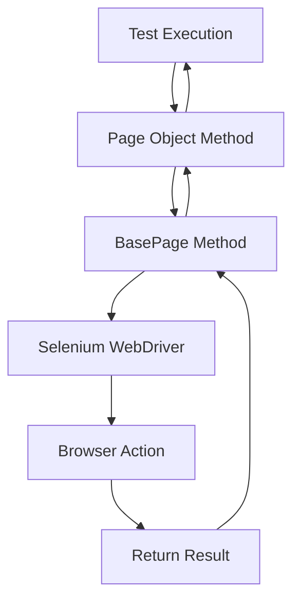

# Video Search Automation Framework
## 📚 Complete Technical Documentation

<div align="center">


</div>

---

## 📋 Document Information

| Property | Value |
|----------|-------|
| **Project** | Video Search Automation Framework |
| **Framework Type** | Selenium-based Python Test Automation |
| **Design Pattern** | Page Object Model (POM) |
| **Test Framework** | Pytest |
| **Reporting** | Allure Reports |
| **Last Updated** | January 9, 2026 |
| **Status** | Active Development |

---

## 📑 Table of Contents

### 🎯 Getting Started
- [Framework Overview](#1-framework-overview)
- [Quick Start Guide](#quick-start-guide)
- [Installation](#installation)

### 🏗️ Architecture & Design
- [Architecture Overview](#2-architecture)
- [Design Patterns](#4-design-patterns)
- [Folder Structure](#3-folder-structure)

### 🔧 Core Components
- [Key Components](#5-key-components)
  - [Page Objects](#51-page-objects-pages)
  - [Locators](#52-locators-locators)
  - [Test Suites](#53-tests-tests)
  - [Utilities](#54-utilities-utils)
  - [Test Data](#55-test-data-data)
  - [Configuration](#56-configuration-files)

### 🚀 Execution & Reports
- [Test Execution](#6-test-execution)
- [Framework Flow](#7-framework-flow)
- [Reporting](#reporting-with-allure)

### 📖 Guidelines & Best Practices
- [Best Practices](#8-best-practices)
- [Coding Standards](#coding-standards)
- [Recommendations](#9-recommendations)

### 📊 Reference
- [Framework Metrics](#10-framework-metrics)
- [Quick Reference](#12-quick-reference)
- [Troubleshooting](#troubleshooting)
- [FAQ](#faq)

---

## 1. Framework Overview

### 🎯 Purpose

This framework automates end-to-end testing of the **Lytx Video Search** application, providing a robust, maintainable, and scalable solution for UI automation testing using Selenium WebDriver with Python.

### 🛠️ Technology Stack

| Category | Technology | Version |
|----------|------------|---------|
| **Language** | Python | 3.7+ |
| **Test Framework** | Pytest | 7.4.3 |
| **Web Automation** | Selenium WebDriver | 4.15+ |
| **Reporting** | Allure Reports | 2.13.2 |
| **API Testing** | Requests | 2.31.0 |
| **Design Pattern** | Page Object Model (POM) | - |

### ✨ Key Features

| Feature | Description | Status |
|---------|-------------|--------|
| 📄 Page Object Model | Separation of page logic from test logic | ✅ Implemented |
| 🎯 Centralized Locators | Single source of truth for UI elements | ✅ Implemented |
| ⚡ Session-Based Fixtures | Efficient browser/login management | ✅ Implemented |
| 📊 Allure Reports | Beautiful HTML reports with detailed insights | ✅ Implemented |
| 🔢 Test Ordering | Controlled test execution sequence | ✅ Implemented |
| 🔗 API Validation | Backend validation alongside UI tests | ✅ Implemented |
| 📦 Data-Driven Testing | Parametrized tests with multiple datasets | ✅ Implemented |
| 🛡️ Error Handling | Comprehensive exception management | ✅ Implemented |
| 📝 Detailed Logging | Step-by-step execution tracking | ✅ Implemented |
| 🔄 Retry Mechanism | Automatic retry for flaky interactions | ✅ Implemented |

---

## Quick Start Guide

### Installation

1. **Clone the repository**
   ```bash
   git clone <repository-url>
   cd Video_Search_Automation
   ```

2. **Install Python dependencies**
   ```bash
   pip install -r requirements.txt
   ```
   
   Or install manually:
   ```bash
   pip install selenium pytest pytest-order allure-pytest requests
   ```

3. **Install Allure Command Line**
   - Download from: https://github.com/allure-framework/allure2/releases
   - Add to system PATH

### Running Tests

**Option 1: Using Batch File (Recommended)**
```bash
.\run_tests_with_allure.bat
```

**Option 2: Command Line**
```bash
# Run tests and generate results
pytest --alluredir=allure-results

# Generate and open report
allure generate allure-results --clean -o allure-report
allure open allure-report
```

**Option 3: Run Specific Tests**
```bash
# Run specific file
pytest tests/test_browse_page.py

# Run specific test
pytest tests/test_browse_page.py::TestBrowsePage::test_vehicle_page_load

# Run by marker
pytest -m smoke
```

---

## 2. Architecture

### 🏗️ High-Level Architecture Diagram

```
┌─────────────────────────────────────────────────────────────────┐
│                     🧪 TEST EXECUTION LAYER                      │
│  ┌────────────────┐  ┌────────────────┐  ┌────────────────┐    │
│  │ test_browse    │  │ test_LQ_15231  │  │  Other Tests   │    │
│  │    _page.py    │  │     .py        │  │                │    │
│  │                │  │                │  │                │    │
│  │ • Test Cases   │  │ • Validations  │  │ • Future Tests │    │
│  │ • Assertions   │  │ • Scenarios    │  │                │    │
│  └────────────────┘  └────────────────┘  └────────────────┘    │
└─────────────────────────────────────────────────────────────────┘
                               ⬇
┌─────────────────────────────────────────────────────────────────┐
│                    📄 PAGE OBJECT LAYER                          │
│  ┌────────────────┐  ┌────────────────┐  ┌────────────────┐    │
│  │   LoginPage    │  │   BrowsePage   │  │ VideoSearchPage│    │
│  │                │  │                │  │                │    │
│  │ • login()      │  │ • navigate()   │  │ • filter()     │    │
│  │ • validate()   │  │ • select()     │  │ • search()     │    │
│  └────────────────┘  └────────────────┘  └────────────────┘    │
└─────────────────────────────────────────────────────────────────┘
                               ⬇
┌─────────────────────────────────────────────────────────────────┐
│                     🔨 BASE PAGE LAYER                           │
│  ┌───────────────────────────────────────────────────────────┐  │
│  │                        BasePage                            │  │
│  │                                                            │  │
│  │  • find()           • click()          • type()           │  │
│  │  • find_elements()  • wait_for()       • get_text()       │  │
│  │  • scroll()         • clear()          • get_attribute()  │  │
│  └───────────────────────────────────────────────────────────┘  │
└─────────────────────────────────────────────────────────────────┘
                               ⬇
┌─────────────────────────────────────────────────────────────────┐
│                     🛠️ SUPPORT LAYERS                            │
│  ┌────────────────┐  ┌────────────────┐  ┌────────────────┐    │
│  │   📍Locators   │  │   📊Test Data  │  │   🔧Utilities  │    │
│  │                │  │                │  │                │    │
│  │ • Login        │  │ • URLs         │  │ • Driver       │    │
│  │ • Browse       │  │ • Credentials  │  │   Factory      │    │
│  │ • VideoSearch  │  │ • Test Params  │  │ • API Client   │    │
│  └────────────────┘  └────────────────┘  └────────────────┘    │
└─────────────────────────────────────────────────────────────────┘
                               ⬇
┌─────────────────────────────────────────────────────────────────┐
│                   🌐 SELENIUM WEBDRIVER                          │
│                   (Browser Automation Engine)                    │
│                                                                  │
│         Chrome  •  Firefox  •  Edge  •  Safari                  │
└─────────────────────────────────────────────────────────────────┘
```

### 🔄 Request Flow



### 📦 Component Interaction

| Layer | Responsibility | Dependencies |
|-------|---------------|--------------|
| **Tests** | Test logic, assertions, scenarios | Page Objects |
| **Page Objects** | Page-specific business logic | BasePage, Locators |
| **BasePage** | Common Selenium operations | WebDriver |
| **Locators** | UI element identifiers | None |
| **Utilities** | Helper functions, factories | WebDriver, Requests |
| **Test Data** | Test parameters, credentials | None |

---

## 3. Folder Structure

### 📁 Complete Directory Layout

```
Video_Search_Automation/
│
├── 📄 pages/                          # Page Object Classes
│   ├── __init__.py
│   ├── base_page.py                   # 🔨 Base class with common methods
│   ├── browse_page.py                 # 🚗 Vehicle browse page
│   ├── login_page.py                  # 🔐 Login page
│   └── VideoSerachPage.py             # 🎥 Video search page
│
├── 📍 locators/                       # Centralized Locators
│   ├── __init__.py
│   ├── locators_login_page.py         # Login page locators
│   └── locators_video_search_page.py  # Video search locators
│
├── 🧪 tests/                          # Test Suites
│   ├── __init__.py
│   ├── test_browse_page.py            # Browse page tests
│   ├── test_LQ_15231.py               # Filter clearing tests
│   └── vs_browse_page.py              # ⚠️ [UNUSED - Can be deleted]
│
├── 🔧 utils/                          # Helper Utilities
│   ├── __init__.py
│   ├── driver_factory.py              # WebDriver factory
│   └── api_helpers.py                 # API client for validation
│
├── 📊 data/                           # Test Data
│   ├── prod/
│   │   └── video_search_data_prod.py  # Production test data
│   └── video_search_test_data.py      # Test data
│
├── 📦 intial_darft_scripts/           # Legacy/Archive Code
│   ├── t_login.py
│   ├── t_vehicle_search.py
│   ├── t_video_searchPage.py
│   ├── t_Vehicle_count.py
│   └── t_group_filter.py
│
├── 📈 allure-results/                 # Allure test results (JSON)
├── 📊 allure-report/                  # Allure HTML reports
├── __pycache__/                       # Python cache
│
├── ⚙️ conftest.py                     # Pytest fixtures & configuration
├── ⚙️ pytest.ini                      # Pytest settings
├── 🚀 run_tests_with_allure.bat       # Test execution script
├── 📖 Readme.txt                      # Quick reference guide
├── 📖 README_TEST_ORDER.md            # Test ordering documentation
└── 📚 Framework_Documentation.md      # This file
```

### 📋 Directory Purpose

| Directory | Purpose | Key Files | Status |
|-----------|---------|-----------|--------|
| `pages/` | Page Object Models | `base_page.py`, `browse_page.py`, `login_page.py` | ✅ Active |
| `locators/` | UI Element Locators | `locators_login_page.py`, `locators_video_search_page.py` | ✅ Active |
| `tests/` | Test Cases | `test_browse_page.py`, `test_LQ_15231.py` | ✅ Active |
| `utils/` | Utilities & Helpers | `driver_factory.py`, `api_helpers.py` | ✅ Active |
| `data/` | Test Data | `video_search_data_prod.py` | ✅ Active |
| `intial_darft_scripts/` | Legacy Code | Old scripts | ⚠️ Archive |
| `allure-results/` | Test Results (JSON) | Auto-generated | 🔄 Generated |
| `allure-report/` | HTML Reports | Auto-generated | 🔄 Generated |

### 🗂️ File Categories

**Core Framework Files:**
- `conftest.py` - Pytest fixtures and configuration
- `pytest.ini` - Pytest settings and markers
- `run_tests_with_allure.bat` - Test execution automation

**Documentation:**
- `Framework_Documentation.md` - Complete framework documentation
- `README_TEST_ORDER.md` - Test execution order guide
- `Readme.txt` - Quick reference

**Generated Files:**
- `allure-results/` - Test execution results (JSON)
- `allure-report/` - HTML test reports
- `__pycache__/` - Python bytecode cache

---

## 4. Design Patterns

### 4.1 Page Object Model (POM)

**Definition:** A design pattern that creates an object repository for web UI elements, separating test logic from page-specific code.

**Implementation:**
```python
# Example: browse_page.py
class BrowsePage(BasePage):
    # Locators defined at class level
    VEHICLE_COUNT = (By.XPATH, '//div[@data-test-id="filter-headerBar-countValue"]')
    
    def get_vehicle_count_text(self):
        """Business logic method"""
        vehicle_count_element = self.find(self.VEHICLE_COUNT)
        return vehicle_count_element.text
```

**Benefits:**
- Code reusability
- Easy maintenance
- Reduced code duplication
- Better readability

### 4.2 Factory Pattern

**Implementation:** `driver_factory.py`
```python
def get_driver(browser="chrome"):
    if browser == "chrome":
        options = webdriver.ChromeOptions()
        options.add_argument("--start-maximized")
        driver = webdriver.Chrome(options=options)
    elif browser == "firefox":
        driver = webdriver.Firefox()
    return driver
```

**Benefits:**
- Easy to add new browsers
- Centralized driver configuration
- Consistent driver initialization

### 4.3 Fixture Pattern (Pytest)

**Implementation:** `conftest.py`
```python
@pytest.fixture(scope="session")
def driver():
    driver = get_driver("chrome")
    # Setup: Login once
    login_page = LoginPage(driver)
    driver.get(VideoSearchDataProd.New_UI_vehiclepage_url)
    login_page.login(...)
    
    yield driver  # Test uses this
    
    # Teardown: Close browser
    driver.quit()
```

**Benefits:**
- Automatic setup and teardown
- Shared resources across tests
- Reduced test execution time

### 4.4 Inheritance Pattern

All page objects inherit from `BasePage`:
```python
class BasePage:
    def find(self, locator):
        return WebDriverWait(self.driver, 60).until(
            ec.presence_of_element_located(locator)
        )
    
    def click(self, locator):
        self.find(locator).click()

class BrowsePage(BasePage):
    # Inherits all BasePage methods
    pass
```

---

## 5. Key Components

### 5.1 Page Objects (`/pages/`)

#### base_page.py (326 lines)
**Purpose:** Base class providing common Selenium operations for all page objects.

**Key Methods:**
- `find(locator)` - Waits up to 60 seconds and locates element
- `find_elements(locator)` - Finds multiple elements with 10s timeout
- `wait_for_element_displayed(locator, timeout=10)` - Waits for visibility
- `click(locator)` - Clicks with retry logic for stale elements
- `type(locator, input_text)` - Sends text to input fields
- `get_text(locator)` - Retrieves element text with error handling
- `get_attribute(locator, attribute)` - Gets element attributes
- `clear(locator)` - Clears input fields
- `back()` - Browser back navigation
- `get_row_count()` - Counts table rows
- `get_random_name(length)` - Generates random strings for test data
- `scroll_into_view(element)` - Scrolls element into view using JavaScript

**Error Handling:**
```python
except (ElementClickInterceptedException, 
        ElementNotInteractableException, 
        StaleElementReferenceException):
    sleep(2)
    self.find(locator).click()  # Retry
```

#### browse_page.py (157 lines)
**Purpose:** Handles vehicle browse page interactions.

**Locators:**
- `VIDEO_SEARCH_TEXT` - Search input field
- `VEHICLE_COUNT` - Vehicle count display
- `PAGE_SIZE_DROPDOWN` - Page size selector
- `BROWSE_VEHICLES` - Browse vehicle links
- `SNAPSHOT_IMAGES` - Vehicle snapshot images
- `MAP_ELEMENT` - Map display

**Key Methods:**
- `wait_for_page_load()` - Waits for page to fully load
- `get_vehicle_count_text()` - Retrieves vehicle count
- `is_vehicle_page_loaded()` - Validates page load
- `set_page_size_to_100()` - Changes pagination size
- `browse_first_vehicle()` - Clicks first vehicle and navigates back
- `browse_vehicle_by_index(index)` - Browses specific vehicle
- `get_snapshot_images()` - Gets all snapshot images
- `verify_snapshot_images_displayed()` - Validates images are visible
- `is_map_displayed()` - Checks map element visibility

#### login_page.py (67 lines)
**Purpose:** Handles login functionality.

**Key Methods:**
- `login(username, password)` - Performs complete login
- `is_login_successful()` - Validates login by checking dashboard
- `enter_username(username)` - Enters username with retry
- `enter_password(password)` - Enters password with retry
- `click_login()` - Clicks login button

**Validation Logic:**
```python
def is_login_successful(self):
    try:
        dashboard_element = WebDriverWait(self.driver, 60).until(
            EC.visibility_of_element_located((By.ID, LV.video_search_page_title_id))
        )
        return dashboard_element.is_displayed()
    except Exception as e:
        print("Login failed:", e)
        return False
```

#### VideoSerachPage.py
**Purpose:** Handles video search page operations including filters and pagination.

**Key Methods:**
- Group filter management
- Vehicle search functionality
- Pagination controls
- Filter clearing operations

---

### 5.2 Locators (`/locators/`)

#### locators_login_page.py
**Purpose:** Centralized storage for login page element identifiers.

**Structure:**
```python
class LocatorsLogin:
    username = 'username'
    password = 'password'
    LOGIN_BTN = 'submitButton'
    humanoid_id = 'profileButton'
    dc_coach_log_out_xpath = '/html/body/app/shell/div/...'
    # ... more locators
```

**Benefits:**
- Single source of truth for locators
- Easy maintenance when UI changes
- No need to update multiple test files

#### locators_video_search_page.py (253 lines)
**Purpose:** Comprehensive locator storage for video search page.

**Categories:**
- Table columns (Actions, Vehicles, Device, Last Communicated, Group, Views)
- Filters (Group filter, Search criteria)
- Pagination elements
- Saved videos page elements
- Search textboxes and dropdowns

---

### 5.3 Tests (`/tests/`)

#### test_browse_page.py (172 lines)
**Test Class:** `TestBrowsePage`

**Test Cases:**

1. **test_vehicle_page_load** (Order: 1)
   - Severity: CRITICAL
   - Verifies page loads with vehicle count displayed
   - Uses Allure steps for detailed reporting

2. **test_browse_first_vehicle** (Order: 2)
   - Severity: NORMAL
   - Clicks first vehicle and navigates back
   - Validates successful navigation

3. **test_set_page_size_100** (Order: 3)
   - Severity: MINOR
   - Changes page size to 100 vehicles
   - Confirms size change

4. **test_verify_snapshot_images** (Order: 4)
   - Severity: CRITICAL
   - Validates snapshot images are displayed
   - Counts visible vs total images
   - Attaches counts to Allure report

5. **test_verify_map_display** (Order: 5)
   - Severity: NORMAL
   - Checks map element visibility
   - Validates map display on vehicle detail page

6. **test_complete_browse_workflow** (Order: 6)
   - Severity: CRITICAL
   - End-to-end workflow test
   - Combines all above scenarios

**Allure Integration:**
```python
@allure.feature("Vehicle Browse")
@allure.story("Browse Page Functionality")
class TestBrowsePage:
    
    @allure.title("Verify vehicle page loads successfully")
    @allure.description("Test to verify that...")
    @allure.severity(allure.severity_level.CRITICAL)
    @pytest.mark.order(1)
    def test_vehicle_page_load(self, driver):
        with allure.step("Initialize Browse Page"):
            browse_page = BrowsePage(driver)
        
        with allure.step("Wait for page to load"):
            browse_page.wait_for_page_load()
```

#### test_LQ_15231.py (253 lines)
**Test Class:** `TestFilterClearing`
**Ticket:** LQ-15231

**Purpose:** Tests filter clearing functionality in Video Search page.

**Key Features:**
- Parametrized tests using `@pytest.mark.parametrize()`
- API validation using `LytxApiClient`
- Compares UI vehicle count with API response
- Tests filter deletion and reset

**Example:**
```python
@pytest.mark.parametrize("group_name,group_id", 
                         VideoSearchDataProd.GROUP_FILTER_TEST_DATA)
def test_delete_group_filter(self, driver, group_name, group_id):
    # Test implementation
    api_client = LytxApiClient(username, password)
    initial_count = video_search_page.get_vehicle_count()
    # Apply filter, verify, clear filter, verify reset
```

---

### 5.4 Utilities (`/utils/`)

#### driver_factory.py (15 lines)
**Purpose:** Factory for creating WebDriver instances.

**Function:** `get_driver(browser="chrome")`
- Supports: Chrome, Firefox
- Configures Chrome options (maximize window)
- Sets implicit wait to 10 seconds
- Raises exception for unsupported browsers

**Usage:**
```python
driver = get_driver("chrome")  # Returns configured Chrome driver
```

#### api_helpers.py (113 lines)
**Purpose:** API client for backend validation.

**Class:** `LytxApiClient`

**Key Methods:**
- `__init__(username, password)` - Initializes and authenticates
- `authenticate()` - Gets access token from auth API
- `get_vehicle_count(group_id, page_size)` - Gets vehicle count via API
- `get_vehicle_count_by_vehicle_name(vehicle_name)` - Filtered count

**Authentication Flow:**
```python
def authenticate(self):
    auth_url = "https://login.lytx.com/api/auth/user"
    auth_data = {"username": self.username, "password": self.password}
    auth_response = requests.post(auth_url, json=auth_data)
    self.token = auth_response.json().get("access_token")
```

**API Validation Pattern:**
```python
# In test
api_client = LytxApiClient(username, password)
api_count = api_client.get_vehicle_count(group_id)
ui_count = video_search_page.get_vehicle_count()
assert api_count == ui_count, "Count mismatch!"
```

---

### 5.5 Test Data (`/data/`)

#### data/prod/video_search_data_prod.py
**Purpose:** Stores production environment test data.

**Class:** `VideoSearchDataProd`

**Data Categories:**

1. **URLs:**
```python
New_UI_vehiclepage_url = "https://app.lytx.com/#/lvs/vehicles"
vehicle_count_url = "https://api.aws.drivecam.net/api/videosearch-api/devices"
```

2. **Credentials:**
```python
login_username = "qa_ind_full_access"
login_password = "Login123!"
```

3. **Test Data Arrays:**
```python
VEHICLE_TEST_DATA = [
    ("Vehicle Name", "QM40849291"),
]

GROUP_FILTER_TEST_DATA = [
    ("Lab Test", "5100ffff-60b6-d6cd-18b2-a8a3e03f0000"),
]

VEHICLE_NAME_SEARCH_DATA = [
    ("QM408", "QM40849291"),  # Partial match
    ("QM40849291", "QM40849291"),  # Exact match
]

SERIAL_NUMBER_SEARCH_DATA = [
    ("QM408", "QM40849291"),
]
```

**Benefits:**
- Data separated from test logic
- Easy to add new test data
- Support for multiple environments (prod, staging, dev)
- Parametrized testing with tuples

---

### 5.6 Configuration Files

#### conftest.py (17 lines)
**Purpose:** Pytest configuration and shared fixtures.

**Session-Scoped Driver Fixture:**
```python
@pytest.fixture(scope="session")
def driver():
    # Setup: Create driver and login
    driver = get_driver("chrome")
    login_page = LoginPage(driver)
    driver.get(VideoSearchDataProd.New_UI_vehiclepage_url)
    login_page.login(VideoSearchDataProd.login_username, 
                     VideoSearchDataProd.login_password)
    assert login_page.is_login_successful(), "Login was not successful."
    
    # Provide driver to all tests
    yield driver
    
    # Teardown: Close browser after all tests
    driver.quit()
```

**Scope Explanation:**
- `scope="session"` - Browser opens once for entire test session
- All tests share the same browser instance
- Login happens only once
- Significantly reduces test execution time

#### pytest.ini
**Purpose:** Pytest configuration file.

**Key Configurations:**

1. **Test Discovery:**
```ini
python_files = test_*.py *_test.py
python_classes = Test*
python_functions = test_*
testpaths = tests
```

2. **Default Command Options:**
```ini
addopts = 
    -v                    # Verbose output
    --strict-markers      # Fail on unknown markers
    --tb=short           # Short traceback format
    --maxfail=5          # Stop after 5 failures
    --alluredir=allure-results
    --color=yes
```

3. **Custom Markers:**
```ini
markers =
    order: marks tests for execution order
    smoke: marks tests as smoke tests
    regression: marks tests as regression tests
    critical: marks tests as critical priority
    browse: marks tests related to browse/vehicle page
    video: marks tests related to video functionality
    # ... more markers
```

4. **Logging:**
```ini
log_cli = true
log_cli_level = INFO
log_file = tests.log
log_file_level = DEBUG
```

#### run_tests_with_allure.bat
**Purpose:** Automated test execution with Allure reporting.

**Script Content:**
```bat
@echo off
REM Run pytest and generate Allure results
pytest --alluredir=allure-results

REM Generate the Allure HTML report
allure generate allure-results --clean -o allure-report

REM Open the Allure report in your browser
allure open allure-report
```

**Usage:** Double-click the .bat file or run from command line.

---

## 6. Test Execution

### Execution Commands

#### Run All Tests
```bash
pytest
# or
pytest --alluredir=allure-results
# or
.\run_tests_with_allure.bat
```

#### Run Specific Test File
```bash
pytest tests/test_browse_page.py
pytest tests/test_LQ_15231.py
```

#### Run Specific Test Class
```bash
pytest tests/test_browse_page.py::TestBrowsePage
```

#### Run Specific Test Method
```bash
pytest tests/test_browse_page.py::TestBrowsePage::test_vehicle_page_load
```

#### Run Tests by Marker
```bash
pytest -m smoke           # Run only smoke tests
pytest -m critical        # Run critical tests
pytest -m browse          # Run browse-related tests
pytest -m "smoke or regression"  # Multiple markers
```

#### Run with Verbose Output
```bash
pytest -v                 # Verbose
pytest -vv                # Very verbose
pytest -s                 # Show print statements
```

#### Parallel Execution (requires pytest-xdist)
```bash
pytest -n auto            # Use all CPU cores
pytest -n 4               # Use 4 workers
```

#### Generate Allure Report
```bash
# Run tests
pytest --alluredir=allure-results

# Generate HTML report
allure generate allure-results --clean -o allure-report

# Open report in browser
allure open allure-report

# Or serve report
allure serve allure-results
```

---

## 7. Framework Flow

### Detailed Execution Flow

```
┌─────────────────────────────────────────────────────────────┐
│ STEP 1: Test Session Initialization                         │
│ - pytest discovers test files                               │
│ - Loads pytest.ini configuration                            │
│ - Loads conftest.py                                         │
└─────────────────────────────────────────────────────────────┘
                            ↓
┌─────────────────────────────────────────────────────────────┐
│ STEP 2: Session Fixture Execution (conftest.py)             │
│ - get_driver("chrome") called                               │
│ - Chrome browser launches (maximized)                       │
│ - Navigate to login page                                    │
│ - LoginPage object created                                  │
│ - login() method called                                     │
│ - Credentials from VideoSearchDataProd used                 │
│ - Login validation performed                                │
│ - Driver fixture yielded to tests                           │
└─────────────────────────────────────────────────────────────┘
                            ↓
┌─────────────────────────────────────────────────────────────┐
│ STEP 3: Test Execution (test_browse_page.py)                │
│                                                              │
│ TEST 1: test_vehicle_page_load (@order(1))                  │
│   ├─ Receives driver fixture                                │
│   ├─ Creates BrowsePage(driver)                             │
│   ├─ BrowsePage inherits from BasePage                      │
│   ├─ Calls wait_for_page_load()                             │
│   │   └─ Uses find() method from BasePage                   │
│   │       └─ WebDriverWait with 60s timeout                 │
│   ├─ Calls get_vehicle_count_text()                         │
│   │   └─ Locator: VEHICLE_COUNT from class                  │
│   ├─ Attaches count to Allure report                        │
│   ├─ Calls is_vehicle_page_loaded()                         │
│   └─ Assert validation passes                               │
│                                                              │
│ TEST 2: test_browse_first_vehicle (@order(2))               │
│   ├─ Reuses same driver (session scope)                     │
│   ├─ Already logged in                                      │
│   ├─ Creates BrowsePage(driver)                             │
│   ├─ Calls wait_for_page_load()                             │
│   ├─ Calls browse_first_vehicle()                           │
│   │   ├─ Finds all browse elements                          │
│   │   ├─ Scrolls first element into view                    │
│   │   ├─ Clicks first element                               │
│   │   ├─ Waits 10 seconds                                   │
│   │   └─ Navigates back                                     │
│   └─ Assert result is True                                  │
│                                                              │
│ TEST 3-6: Similar pattern continues...                      │
│   - Each test creates own page object                       │
│   - Shares same driver session                              │
│   - Allure captures each step                               │
│   - Screenshots on failure                                  │
└─────────────────────────────────────────────────────────────┘
                            ↓
┌─────────────────────────────────────────────────────────────┐
│ STEP 4: Test Completion                                     │
│ - All tests in TestBrowsePage class complete                │
│ - Allure results written to allure-results/                 │
│ - Each test has JSON file with results                      │
└─────────────────────────────────────────────────────────────┘
                            ↓
┌─────────────────────────────────────────────────────────────┐
│ STEP 5: Fixture Teardown                                    │
│ - After all tests complete                                  │
│ - driver.quit() called (in conftest.py)                     │
│ - Browser closes                                            │
│ - Cleanup complete                                          │
└─────────────────────────────────────────────────────────────┘
                            ↓
┌─────────────────────────────────────────────────────────────┐
│ STEP 6: Report Generation                                   │
│ - allure generate command executed                          │
│ - JSON results parsed                                       │
│ - HTML report created in allure-report/                     │
│ - Interactive dashboard with graphs and charts              │
│ - allure open command launches browser                      │
└─────────────────────────────────────────────────────────────┘
```

### Test Execution Sequence

**Order of Test Execution (based on @pytest.mark.order):**

1. `test_vehicle_page_load` - Order 1
2. `test_browse_first_vehicle` - Order 2
3. `test_set_page_size_100` - Order 3
4. `test_verify_snapshot_images` - Order 4
5. `test_verify_map_display` - Order 5
6. `test_complete_browse_workflow` - Order 6

**Dependency Chain:**
- Tests depend on successful login (handled in conftest.py)
- Each test assumes vehicle page is accessible
- Some tests depend on previous tests' side effects

---

## 8. Best Practices

### What This Framework Does Well

#### 1. Separation of Concerns
✅ **Implementation:**
- Tests in `/tests/`
- Page logic in `/pages/`
- Locators in `/locators/`
- Data in `/data/`
- Utilities in `/utils/`

✅ **Benefit:** Easy to maintain and scale

#### 2. DRY Principle (Don't Repeat Yourself)
✅ **Implementation:**
- BasePage contains all common Selenium operations
- All page objects inherit from BasePage
- No duplicate click, find, or wait logic

✅ **Benefit:** Changes in one place affect all pages

#### 3. Explicit Waits
✅ **Implementation:**
```python
def find(self, locator):
    return WebDriverWait(self.driver, 60).until(
        ec.presence_of_element_located(locator)
    )
```

✅ **Benefit:** More reliable than implicit waits

#### 4. Error Handling
✅ **Implementation:**
```python
try:
    self.find(locator).click()
except (ElementClickInterceptedException, 
        StaleElementReferenceException):
    sleep(2)
    self.find(locator).click()  # Retry
```

✅ **Benefit:** Tests more stable and resilient

#### 5. Session-Scoped Fixtures
✅ **Implementation:**
```python
@pytest.fixture(scope="session")
def driver():
    # Opens browser once
    # Login once
    yield driver
    # Closes after all tests
```

✅ **Benefit:** Faster test execution

#### 6. Allure Reporting
✅ **Implementation:**
- Feature and story decorators
- Severity levels
- Step-by-step execution tracking
- Screenshots and attachments

✅ **Benefit:** Beautiful, detailed test reports

#### 7. Data-Driven Testing
✅ **Implementation:**
```python
@pytest.mark.parametrize("group_name,group_id", 
                         VideoSearchDataProd.GROUP_FILTER_TEST_DATA)
def test_delete_group_filter(self, driver, group_name, group_id):
    # Test runs for each tuple in test data
```

✅ **Benefit:** One test, multiple data sets

#### 8. API Validation
✅ **Implementation:**
- UI tests validate against API responses
- LytxApiClient for backend calls
- Compare UI counts with API counts

✅ **Benefit:** Ensures UI and backend sync

#### 9. Centralized Configuration
✅ **Implementation:**
- pytest.ini for pytest settings
- conftest.py for fixtures
- driver_factory.py for driver config

✅ **Benefit:** Single source of configuration

#### 10. Clear Naming Conventions
✅ **Implementation:**
- Test files: `test_*.py`
- Test classes: `Test*`
- Test methods: `test_*`
- Page objects: `*Page`
- Locators: `Locators*`

✅ **Benefit:** Easy to understand and navigate

---

## 9. Recommendations

### Areas for Improvement

#### 1. Move All Locators to Locator Files
**Current State:**
Some locators are in page classes:
```python
# browse_page.py
VIDEO_SEARCH_TEXT = (By.ID, "videoSearchText")
```

**Recommended:**
Move to locators file:
```python
# locators_browse_page.py
class LocatorsBrowsePage:
    VIDEO_SEARCH_TEXT = 'videoSearchText'
    
# browse_page.py
VIDEO_SEARCH_TEXT = (By.ID, LB.VIDEO_SEARCH_TEXT)
```

**Benefit:** Complete separation of locators

---

#### 2. Replace Sleep with Explicit Waits
**Current State:**
```python
sleep(10)  # Hard wait
```

**Recommended:**
```python
WebDriverWait(self.driver, 10).until(
    EC.element_to_be_clickable(locator)
)
```

**Benefit:** Tests run faster and are more reliable

---

#### 3. Create requirements.txt
**Recommended:**
```txt
selenium==4.15.0
pytest==7.4.3
pytest-order==1.1.0
allure-pytest==2.13.2
requests==2.31.0
```

**Command:**
```bash
pip freeze > requirements.txt
```

**Benefit:** Easy environment setup

---

#### 4. Add Screenshot on Failure
**Recommended:**
Add to conftest.py:
```python
@pytest.hookimpl(tryfirst=True, hookwrapper=True)
def pytest_runtest_makereport(item, call):
    outcome = yield
    rep = outcome.get_result()
    if rep.when == 'call' and rep.failed:
        driver = item.funcargs['driver']
        allure.attach(
            driver.get_screenshot_as_png(),
            name='screenshot',
            attachment_type=allure.attachment_type.PNG
        )
```

**Benefit:** Debug failures easily

---

#### 5. Environment Configuration
**Recommended:**
Create config files for each environment:
```python
# config/prod.py
BASE_URL = "https://app.lytx.com"
USERNAME = "qa_user"

# config/staging.py
BASE_URL = "https://staging.lytx.com"
USERNAME = "qa_user_staging"
```

**Usage:**
```python
from config import prod as config
driver.get(config.BASE_URL)
```

**Benefit:** Easy environment switching

---

#### 6. Add Logging
**Recommended:**
```python
import logging

logger = logging.getLogger(__name__)
logger.info(f"Clicking element: {locator}")
logger.error(f"Failed to find: {locator}")
```

**Benefit:** Better debugging

---

#### 7. Create Utilities for Common Operations
**Recommended:**
```python
# utils/wait_helpers.py
def wait_for_element(driver, locator, timeout=30):
    return WebDriverWait(driver, timeout).until(
        EC.visibility_of_element_located(locator)
    )

def wait_for_element_clickable(driver, locator, timeout=30):
    return WebDriverWait(driver, timeout).until(
        EC.element_to_be_clickable(locator)
    )
```

**Benefit:** Reusable wait strategies

---

#### 8. Add CI/CD Integration
**Recommended:**
Create `.github/workflows/tests.yml`:
```yaml
name: Run Tests
on: [push, pull_request]
jobs:
  test:
    runs-on: windows-latest
    steps:
      - uses: actions/checkout@v2
      - uses: actions/setup-python@v2
      - run: pip install -r requirements.txt
      - run: pytest --alluredir=allure-results
      - uses: actions/upload-artifact@v2
        with:
          name: allure-results
          path: allure-results
```

**Benefit:** Automated testing on every commit

---

#### 9. Remove Unused Files
**Action Items:**
- Delete `tests/vs_browse_page.py` (not used)
- Archive `intial_darft_scripts/` folder (old code)

**Benefit:** Cleaner codebase

---

#### 10. Add Docstrings
**Recommended:**
```python
def browse_vehicle_by_index(self, index):
    """
    Browse a specific vehicle by its index in the list.
    
    Args:
        index (int): Zero-based index of vehicle to browse
        
    Returns:
        str: Vehicle name if found, None otherwise
        
    Raises:
        TimeoutException: If vehicle element not found
        
    Example:
        >>> browse_page.browse_vehicle_by_index(2)
        'Vehicle ABC123'
    """
    # Implementation
```

**Benefit:** Better code documentation

---

## 10. Framework Metrics

### Code Statistics
- **Total Python Files:** 21
- **Test Files:** 2
- **Page Objects:** 4
- **Utility Files:** 2
- **Locator Files:** 2
- **Test Data Files:** 2

### Test Coverage
- **Browse Page Tests:** 6 test cases
- **Filter Tests:** Multiple (LQ-15231)
- **Total Test Methods:** 10+

### Framework Size
- **Base Page:** 326 lines
- **Browse Page:** 157 lines
- **Login Page:** 67 lines
- **Test Suite (Browse):** 172 lines
- **Test Suite (Filter):** 253 lines

---

## 11. Conclusion

This Video Search Automation Framework is a well-structured, maintainable, and scalable solution for automated testing. It follows industry best practices and design patterns, making it easy for team members to understand and contribute.

### 💪 Key Strengths

| # | Strength | Impact |
|---|----------|--------|
| 1 | Clean architecture with Page Object Model | 🎯 High Maintainability |
| 2 | Centralized locator management | 🔄 Easy Updates |
| 3 | Comprehensive error handling | 🛡️ Robust Tests |
| 4 | Beautiful Allure reporting | 📊 Clear Insights |
| 5 | API validation integration | ✅ E2E Validation |
| 6 | Data-driven testing support | 📦 Scalable Tests |
| 7 | Session-based fixture for efficiency | ⚡ Fast Execution |
| 8 | Clear folder structure | 📂 Easy Navigation |
| 9 | Test execution ordering | 🔢 Controlled Flow |
| 10 | Professional code organization | 👥 Team-Friendly |

### 🔄 Continuous Improvement

The framework has room for enhancements (as detailed in [Recommendations](#9-recommendations) section), but its current state demonstrates solid automation engineering practices.

### 🔧 Maintenance Guidelines

| Activity | Frequency | Responsibility |
|----------|-----------|----------------|
| Update locators when UI changes | As needed | QA Engineer |
| Add new test cases for features | Sprint-based | QA Team |
| Review and refactor page objects | Quarterly | Tech Lead |
| Validate test data accuracy | Monthly | QA Engineer |
| Update dependencies | Quarterly | DevOps/QA |
| Clean up allure-results | Weekly | Automated |

---

## 12. Quick Reference

### 🚀 Common Commands

```bash
# ========== Test Execution ==========
# Run all tests
pytest

# Run all tests with Allure report
pytest --alluredir=allure-results

# Run using batch file
.\run_tests_with_allure.bat

# Run specific test file
pytest tests/test_browse_page.py

# Run specific test class
pytest tests/test_browse_page.py::TestBrowsePage

# Run specific test method
pytest tests/test_browse_page.py::TestBrowsePage::test_vehicle_page_load

# ========== Markers ==========
# Run tests by marker
pytest -m smoke
pytest -m critical
pytest -m browse
pytest -m "smoke or regression"

# ========== Output Options ==========
# Verbose output
pytest -v

# Very verbose
pytest -vv

# Show print statements
pytest -s

# Stop after first failure
pytest -x

# Stop after N failures
pytest --maxfail=3

# ========== Allure Reports ==========
# Generate Allure report
allure generate allure-results --clean -o allure-report

# Open Allure report
allure open allure-report

# Serve Allure report
allure serve allure-results

# ========== Parallel Execution ==========
# Run in parallel (requires pytest-xdist)
pytest -n auto
pytest -n 4

# ========== Debugging ==========
# Run with Python debugger
pytest --pdb

# Show local variables in tracebacks
pytest -l

# Full traceback
pytest --tb=long
```

### 📂 Important File Locations

| Category | Path | Description |
|----------|------|-------------|
| **Tests** | `tests/` | All test files |
| **Page Objects** | `pages/` | Page object classes |
| **Locators** | `locators/` | UI element locators |
| **Test Data** | `data/prod/` | Production test data |
| **Config** | `conftest.py` | Pytest fixtures |
| **Settings** | `pytest.ini` | Pytest configuration |
| **Reports** | `allure-report/` | HTML test reports |

### 🔑 Key Classes & Methods

#### BasePage
```python
from pages.base_page import BasePage

# Common methods
page.find(locator)
page.click(locator)
page.type(locator, text)
page.get_text(locator)
page.wait_for_element_displayed(locator)
```

#### BrowsePage
```python
from pages.browse_page import BrowsePage

browse_page = BrowsePage(driver)
browse_page.wait_for_page_load()
browse_page.get_vehicle_count_text()
browse_page.browse_first_vehicle()
```

#### LoginPage
```python
from pages.login_page import LoginPage

login_page = LoginPage(driver)
login_page.login(username, password)
is_successful = login_page.is_login_successful()
```

### 📊 Test Data Access

```python
from data.prod.video_search_data_prod import VideoSearchDataProd

# URLs
url = VideoSearchDataProd.New_UI_vehiclepage_url

# Credentials
username = VideoSearchDataProd.login_username
password = VideoSearchDataProd.login_password

# Test Data
vehicles = VideoSearchDataProd.VEHICLE_TEST_DATA
groups = VideoSearchDataProd.GROUP_FILTER_TEST_DATA
```

---

## Troubleshooting

### 🔧 Common Issues & Solutions

#### Issue 1: Browser Not Opening
**Problem:** Tests fail with "WebDriver not found" error

**Solutions:**
```bash
# Option 1: Update ChromeDriver
pip install --upgrade selenium

# Option 2: Manually download ChromeDriver
# Visit: https://chromedriver.chromium.org/
# Place in PATH or project directory

# Option 3: Use webdriver-manager
pip install webdriver-manager
```

**Code Fix:**
```python
from selenium import webdriver
from webdriver_manager.chrome import ChromeDriverManager

driver = webdriver.Chrome(ChromeDriverManager().install())
```

#### Issue 2: Element Not Found
**Problem:** `NoSuchElementException` or `TimeoutException`

**Solutions:**
1. Check if locator is correct
2. Increase wait time in `base_page.py`
3. Check if element is in iframe
4. Verify element is not dynamically loaded

**Debug Code:**
```python
# Add explicit wait
from selenium.webdriver.support.ui import WebDriverWait
from selenium.webdriver.support import expected_conditions as EC

element = WebDriverWait(driver, 30).until(
    EC.presence_of_element_located(locator)
)
```

#### Issue 3: Stale Element Reference
**Problem:** Element exists but can't interact with it

**Solution:** Already handled in BasePage, but if needed:
```python
from selenium.common.exceptions import StaleElementReferenceException

for i in range(3):
    try:
        element.click()
        break
    except StaleElementReferenceException:
        time.sleep(1)
        element = driver.find_element(*locator)
```

#### Issue 4: Login Fails
**Problem:** Test fails at login step

**Checklist:**
- [ ] Verify credentials in `video_search_data_prod.py`
- [ ] Check if URL is accessible
- [ ] Ensure login page loaded completely
- [ ] Check for CAPTCHA or 2FA
- [ ] Verify locators haven't changed

#### Issue 5: Allure Report Not Generated
**Problem:** No report or empty report

**Solutions:**
```bash
# Verify Allure is installed
allure --version

# Clean old results
rm -rf allure-results allure-report

# Run tests with allure
pytest --alluredir=allure-results

# Generate fresh report
allure generate allure-results --clean -o allure-report
```

#### Issue 6: Tests Fail After UI Update
**Problem:** Multiple tests fail after application update

**Action Plan:**
1. Identify changed UI elements
2. Update locators in `locators/` directory
3. Update page methods if logic changed
4. Re-run tests to verify fixes

---

## FAQ

### ❓ Frequently Asked Questions

**Q1: How do I add a new test?**
```python
# In tests/test_browse_page.py
@allure.title("Your test title")
@allure.severity(allure.severity_level.NORMAL)
@pytest.mark.order(7)  # Set order
def test_your_new_test(self, driver):
    with allure.step("Step 1"):
        # Your test logic
        pass
```

**Q2: How do I add a new page object?**
```python
# Create pages/new_page.py
from pages.base_page import BasePage

class NewPage(BasePage):
    # Define locators
    ELEMENT = (By.ID, "element_id")
    
    def __init__(self, driver):
        super().__init__(driver)
    
    def your_method(self):
        self.click(self.ELEMENT)
```

**Q3: How do I run tests in different environments?**
```python
# Option 1: Use environment variable
import os
env = os.getenv('TEST_ENV', 'prod')

# Option 2: Command line argument
pytest --env=staging

# Option 3: Create env-specific data files
from data.staging.video_search_data_staging import VideoSearchDataStaging
```

**Q4: Can I run tests in different browsers?**
```python
# Update conftest.py
@pytest.fixture(scope="session")
def driver(request):
    browser = request.config.getoption("--browser", default="chrome")
    driver = get_driver(browser)
    # ... rest of the code

# Add to pytest.ini
[pytest]
addopts = --browser=chrome

# Run with different browser
pytest --browser=firefox
```

**Q5: How do I debug a failing test?**
```bash
# Option 1: Run with print statements
pytest -s tests/test_browse_page.py

# Option 2: Use Python debugger
pytest --pdb tests/test_browse_page.py

# Option 3: Run single test with verbose
pytest -vv tests/test_browse_page.py::TestBrowsePage::test_vehicle_page_load

# Option 4: Add screenshot in test
import allure
allure.attach(driver.get_screenshot_as_png(), 
              name="debug_screenshot", 
              attachment_type=allure.attachment_type.PNG)
```

**Q6: What is the session scope fixture?**

Session scope means the fixture (browser) is created once for the entire test session, shared across all tests, and destroyed after all tests complete. This saves time by avoiding repeated browser launches and logins.

**Q7: How do I add test data?**
```python
# In data/prod/video_search_data_prod.py
class VideoSearchDataProd:
    # Add your data
    NEW_TEST_DATA = [
        ("param1", "value1"),
        ("param2", "value2"),
    ]

# Use in test
@pytest.mark.parametrize("param,value", VideoSearchDataProd.NEW_TEST_DATA)
def test_with_data(self, driver, param, value):
    # Use param and value in test
    pass
```

**Q8: How long should tests take to run?**

Current timings (approximate):
- Single test: 5-30 seconds
- Browse page suite: 2-3 minutes
- All tests: 5-10 minutes

Session-scoped fixture significantly reduces total execution time.

**Q9: Can I run tests in parallel?**
```bash
# Install pytest-xdist
pip install pytest-xdist

# Run in parallel
pytest -n auto  # Use all CPU cores
pytest -n 4     # Use 4 workers

# Note: May need to handle session scope fixture for parallel execution
```

**Q10: How do I update Python dependencies?**
```bash
# View installed packages
pip list

# Update specific package
pip install --upgrade selenium

# Update all packages (careful!)
pip list --outdated
pip install --upgrade <package_name>

# Create/update requirements.txt
pip freeze > requirements.txt
```

---

## Coding Standards

### 🎨 Python Style Guide

This framework follows PEP 8 style guidelines with some project-specific conventions:

#### Naming Conventions
```python
# Classes: PascalCase
class BrowsePage:
    pass

# Functions/Methods: snake_case
def get_vehicle_count():
    pass

# Constants: UPPER_SNAKE_CASE
VIDEO_SEARCH_URL = "https://..."

# Private methods: _leading_underscore
def _internal_helper():
    pass

# Locators: UPPER_SNAKE_CASE
LOGIN_BUTTON = (By.ID, "loginBtn")
```

#### Import Organization
```python
# Standard library
import os
import time
from datetime import datetime

# Third-party
import pytest
import allure
from selenium import webdriver
from selenium.webdriver.common.by import By

# Local application
from pages.base_page import BasePage
from data.prod.video_search_data_prod import VideoSearchDataProd
```

#### Docstrings
```python
def method_name(self, param1, param2):
    """
    Brief description of what the method does.
    
    Args:
        param1 (type): Description of param1
        param2 (type): Description of param2
    
    Returns:
        type: Description of return value
    
    Raises:
        ExceptionType: When this exception occurs
    """
    pass
```

#### Test Method Structure
```python
def test_feature_name(self, driver):
    """Test description"""
    # Arrange: Set up test data and objects
    page = BrowsePage(driver)
    expected_count = 10
    
    # Act: Perform the action being tested
    actual_count = page.get_vehicle_count()
    
    # Assert: Verify the results
    assert actual_count == expected_count
```

---

## Reporting with Allure

### 📊 Allure Features

#### Test Organization
```python
@allure.feature("Vehicle Browse")  # High-level feature
@allure.story("Browse Functionality")  # User story
@allure.title("Verify vehicle page loads")  # Test title
@allure.description("Detailed test description")  # Full description
@allure.severity(allure.severity_level.CRITICAL)  # Priority
```

#### Test Steps
```python
with allure.step("Navigate to login page"):
    driver.get(url)

with allure.step("Enter credentials"):
    login_page.login(username, password)

with allure.step("Verify login success"):
    assert login_page.is_login_successful()
```

#### Attachments
```python
# Attach text
allure.attach(text_data, name="description", attachment_type=allure.attachment_type.TEXT)

# Attach screenshot
allure.attach(driver.get_screenshot_as_png(), 
              name="screenshot", 
              attachment_type=allure.attachment_type.PNG)

# Attach HTML
allure.attach(html_content, 
              name="page_source", 
              attachment_type=allure.attachment_type.HTML)
```

#### Severity Levels
- `BLOCKER` - Critical functionality is broken
- `CRITICAL` - Major feature doesn't work
- `NORMAL` - Regular test case
- `MINOR` - Minor issue or edge case
- `TRIVIAL` - UI/UX issue

### 📈 Report Analysis

Allure report includes:
- ✅ Test execution summary
- 📊 Graphs and charts
- 🔍 Detailed test steps
- 📸 Screenshots on failure
- 📝 Logs and attachments
- ⏱️ Execution time trends
- 📈 Test history
- 🏷️ Categories and tags

---

## Contact & Support

### 📞 Getting Help

**For questions or issues with this framework:**

1. **Documentation**
   - [Framework_Documentation.md](Framework_Documentation.md) - This file
   - [README_TEST_ORDER.md](README_TEST_ORDER.md) - Test execution order
   - [Readme.txt](Readme.txt) - Quick reference

2. **Code Issues**
   - Check error logs in console
   - Review Allure report for failed tests
   - Check `pytest.log` for detailed logs

3. **Team Support**
   - Contact: QA Team Lead
   - Email: qa-team@company.com
   - Slack: #qa-automation

### 🤝 Contributing

To contribute to this framework:

1. Create a feature branch
2. Make your changes
3. Add/update tests
4. Update documentation
5. Submit pull request
6. Request code review

### 📝 Version History

| Version | Date | Changes | Author |
|---------|------|---------|--------|
| 1.0 | Dec 26, 2025 | Initial framework | QA Team |
| 1.1 | Jan 9, 2026 | Updated documentation structure | QA Team |

---

**Document End**

*Last Updated: January 9, 2026*  
*Framework Version: 1.1*  
*Python Version: 3.7+*  
*Maintained by: QA Automation Team*

---

<div align="center">

### 🌟 Happy Testing! 🌟

Made with ❤️ by the QA Automation Team

</div>
